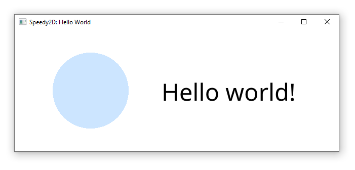

# Speedy2D

[](https://crates.io/crates/speedy2d)
[](https://docs.rs/speedy2d)
[](hhttps://github.com/QuantumBadger/Speedy2D/actions)

Hardware-accelerated drawing of shapes, images, and text, with an easy to
use API.

Speedy2D aims to be:

 - The simplest Rust API for creating a window, rendering graphics/text, and
   handling input
 - Compatible with any device supporting OpenGL 2.0+ or WebGL 2.0. Support for
   OpenGL ES 2.0+ is planned
 - Very fast

Supports Windows, Mac, Linux, and WebGL. Support for Android and iOS is in
development.

By default, Speedy2D contains support for setting up a window with an OpenGL
context, and receiving input events. If you'd like to handle this yourself, and
use Speedy2D only for rendering, you can disable the `windowing` feature.


## Useful Links

* Documentation and getting started guide: https://docs.rs/speedy2d
* Crate: https://crates.io/crates/speedy2d

## Features

|                          | Windows | Mac | Linux | Web        |
|--------------------------|---------|-----|-------|:-----------|
| Draw 2D shapes           | ✔️      | ✔️  | ✔️    | ✔️         |
| Load fonts and draw text | ✔️      | ✔️  | ✔️    | ✔️         |
| Load and draw images     | ✔️      | ✔️  | ✔️    | ✔️         |
| Mouse events             | ✔️      | ✔️  | ✔️    | ✔️         |
| Keyboard events          | ✔️      | ✔️  | ✔️    | ✔️         |
| Fullscreen               | ✔️      | ✔️  | ✔️    | ✔️         |
| Window control           | ✔️      | ✔️  | ✔️    | ℹ️ Partial |
| DPI/scale change events  | ✔️      | ✔️  | ✔️    | ✔️         |
| System clock/timer       | ✔️      | ✔️  | ✔️    | ✔️         |

## Example code

* [Hello world, with text rendering](examples/hello_world.rs)
* [Animation](examples/animation.rs)
* [All input callbacks](examples/input_callbacks.rs)
* [User-generated events](examples/user_events.rs)
* [WebGL](examples/webgl) (see the [WebGL](#webgl) section below for details)

The example projects can be run using `cargo run --example=hello_world` (just
change `hello_world` to the name of the example source file).

[](examples/hello_world.rs)

## Quick Start (Windows/Mac/Linux)

**Step 1:** Add Speedy2D to your `Cargo.toml` dependencies:

```toml
[dependencies]
speedy2d = "1.12.0"
```

**Step 2:** Create a window:

```rust
use speedy2d::Window;

let window = Window::new_centered("Title", (640, 480)).unwrap();
```

**Step 3:** Create a struct implementing the `WindowHandler` trait. Override
whichever callbacks you're interested in, for example `on_draw()`,
`on_mouse_move()`, or `on_key_down()`.

```rust
use speedy2d::color::Color;
use speedy2d::window::{WindowHandler, WindowHelper};
use speedy2d::Graphics2D;

struct MyWindowHandler {}

impl WindowHandler for MyWindowHandler
{
    fn on_draw(&mut self, helper: &mut WindowHelper, graphics: &mut Graphics2D)
    {
        graphics.clear_screen(Color::from_rgb(0.8, 0.9, 1.0));
        graphics.draw_circle((100.0, 100.0), 75.0, Color::BLUE);

        // Request that we draw another frame once this one has finished
        helper.request_redraw();
    }

   // If desired, on_mouse_move(), on_key_down(), etc...
}
```

**Step 4:** Finally, start the event loop by passing your new `WindowHandler`
to the `run_loop()` function. 

```rust
window.run_loop(MyWindowHandler{});
```

**That's it!**

For a more detailed getting started guide, including a full list of `WindowHandler`
callbacks, and how to render text, go to
[docs.rs/speedy2d](https://docs.rs/speedy2d).

The full code of the above example is below for your convenience:

```rust
use speedy2d::color::Color;
use speedy2d::{Graphics2D, Window};
use speedy2d::window::{WindowHandler, WindowHelper};

fn main() {
    let window = Window::new_centered("Title", (640, 480)).unwrap();
    window.run_loop(MyWindowHandler{});
}

struct MyWindowHandler {}

impl WindowHandler for MyWindowHandler
{
    fn on_draw(&mut self, helper: &mut WindowHelper, graphics: &mut Graphics2D)
    {
        graphics.clear_screen(Color::from_rgb(0.8, 0.9, 1.0));
        graphics.draw_circle((100.0, 100.0), 75.0, Color::BLUE);
        helper.request_redraw();
    }
}
```

### Alternative: Managing the GL context yourself

If you'd rather handle the window creation and OpenGL context management
yourself, simply disable Speedy2D's `windowing` feature in your `Cargo.toml`
file, and create a context as follows. You will need to specify a loader
function to allow Speedy2D to obtain the OpenGL function pointers.

```rust
use speedy2d::GLRenderer;

let mut renderer = unsafe {
    GLRenderer::new_for_gl_context((640, 480), |fn_name| {
        window_context.get_proc_address(fn_name) as *const _
    })
}.unwrap();
```

Then, draw a frame using `GLRenderer::draw_frame()`:

```rust
renderer.draw_frame(|graphics| {
    graphics.clear_screen(Color::WHITE);
    graphics.draw_circle((100.0, 100.0), 75.0, Color::BLUE);
});
```

## <a name="webgl"></a>WebGL

[Full tutorial for using Speedy2D with WebGL](https://quantumbadger.com/2021/12/using-webgl-with-speedy2d.html)

To use Speedy2D with WebGL, your app must be compiled for WebAssembly.
Speedy2D can attach itself to a `canvas` on the page using an ID you
specify.

As with Windows/Mac/Linux targets, it's possible to use Speedy2D either in a
full rendering and event handling configuation, or for rendering only.

For rendering only, use the following API:

* `GLRenderer::new_for_web_canvas_by_id()`

For full keyboard/mouse/etc event handling in addition to rendering, use:

* `WebCanvas::new_for_id()`
* `WebCanvas::new_for_id_with_user_events()`

After initialization, the usual `WindowHandler` callbacks and
`WindowHelper`/`Graphics2D` APIs should operate as on other platforms.

For an example, see the `examples/webgl` directory. To build this, first install
the prerequisites:

```shell
cargo install wasm-bindgen-cli just
```

Then use the following command to run the build:

```shell
just build-example-webgl
```

## License

Speedy2D is licensed under the Apache license, version 2.0. See
[LICENSE](LICENSE) for more details.

## Contributing

Pull requests for Speedy2D are always welcome. Please ensure the following
checks pass locally before submitting.

Note: the automated tests currently only run on Linux.

```shell
cargo test
cargo test --no-default-features --lib --examples --tests
cargo clippy
cargo +nightly fmt -- --check
cargo doc
cargo build --target wasm32-unknown-unknown
cargo build --target wasm32-unknown-unknown --no-default-features
```

These commands can be run automatically using `just`:

```shell
just precommit
```

Some tests require the ability to create a headless OpenGL context.
